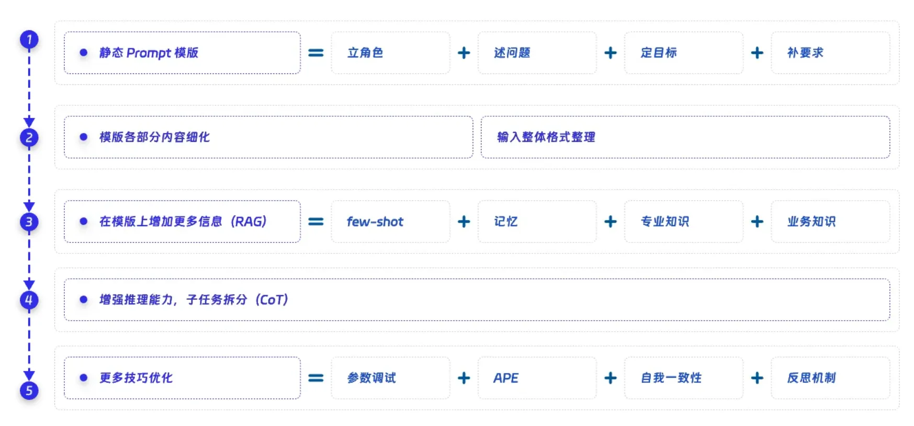

# 简述

为了方便 bug report 的数据提取，我将从 gcc bugzilla 搜索得到的 bug report 整理成结构化形式，也便于之后可能的模型训练。目前想法是提取以下数据：

- id：bug report id
- summary：体现 bug issuer 对 bug 的理解
- status：committee 对 bug report 的性质认定，可以用来验证
- comment：bug issuer 提交 report 时的第一手描述信息，是判断的主要信息

关于数据组织形式，我的初步打算是用 json 格式，如果效果不好，考虑使用 mongoDB。

为了降低复杂度，对于存在附件，或是超链接的情况暂时不考虑。

# 流程

在上一学期的基础上，本学期需要在改进上学期实现内容的缺陷基础上，引入更完善的报告分析和决策机制，最终实现根据现行分类标准的漏洞报告归类去重。

这是一个长期的工作，预计需要半年时间。我们将目标拆解，分成多个阶段逐步达成。切忌急功近利，也不拖延敷衍，牢记能用、够用、好用的开发曲线。

以下是项目开发流程图：

受课程和课题组要求影响，进度上可能存在一定差异，阶段之间不是完全的分离，大约存在一周左右的过渡时间。

# 结构总览

### **1. 数据预处理**

- **文本清洗**：去除无关字符、标准化术语、纠正拼写错误。LLM可辅助自动修正。
- **关键信息提取**：提取源代码、用户描述和开发者回复。
- **结构化处理**：将非结构化文本转化为结构化数据，如错误代码片段及对应功能，形成一个 json 文件。
- **低质量报告淘汰**：若报告有效信息含量太低则标签为低质量报告，若未附源代码则跳过分析。

---

### **2. 推理分析**

- **分步推理**：利用 CoT 让 LLM 模拟人类推理过程，分步骤进行。
  - **长代码处理**：对上下文的代码，先要求根据输入内容和用户描述定位到关键代码块，识别有问题的变量和函数，再聚焦分析。
- **概念约束**：添加约束条件，针对边缘情况定向排除。

---

### **3. 输出总结**

- **语义分解**：
  将 CISB 语义拆解成一些子问题，让 LLM 回答一些系列二分问题，之后综合评判。
- **二分问答**：
  根据回答结果综合判断是否存在 CISB，加上一句话总结便于人工检查。

# 克服的问题
## 偷懒
若上下文较长，模型可能会简单看完开头结尾然后直接下结论，略过中间的复杂推理。  
### 解决方案
将代码分析提前到数据预处理，分块拆解代码。先不要求做漏洞分析而是代码阅读，之后根据用户描述和代码输出结果回溯定位到一块代码中去，再聚焦分析。

## 幻觉
模型输出时，由于信息不足导致对用户架构假设、C 语言标准、用户预期依赖、内置函数特性、编译器行为。
### 解决方案
在数据预处理时推断代码预期，并与用户描述核对，检查是否匹配。

## 编程错误
编程错误是指用户未遵守语言或编译器特性，使用了其指明为错误的方式编程，而且可以被其他关键字纠正。这样的编程错误可能被误认为是 CISB。

### 解决方案
拆解 CISB 语义，通过问题回答提醒 LLM，缓解概念遗忘。

# Prompt

首先是静态模板，保证好用，后面再加内容，构成如图：

## 2.5 Version

2.5 版本主要提高了 LLM 代码分析能力，部分解决推理过程偷懒、短路价值判断、安全理解不到位等问题。提高了分类准确度，并有效降低误报率。按照 OpenAI doc 重构了 prompt 格式。

改进思路：使用模块化分解代码、根据调用链追踪可疑变量和函数、针对输出信息精确定位，引导模型先聚焦，后分析。

具体修改：修改 Digestor，先总结【用户预期】、【输出差异】，不让模型直接找 bug，而是让它将代码分成多个逻辑块，总结每个块功能。调整 Reasoner，让它推理 Digestor 生成的代码逻辑块，结合用户预取和输出差异判断最有可能导致 bug 的块，之后聚焦分析这一段的实现预期和优化冲突。

为了缓解模型幻觉，长上下文遗忘问题，考虑将 CISB 语义分解。在基于模块化代码分析的基础上，添加多层次问答机制，实现自动化分析结果评估，并缓解遗忘降低 FP。经过三轮测试，最终 FPR 稳定在 35% 左右，相比降低了 15%。

### Digestor

"""

You are an expert bug report extraction assistant. Analyze the given bug report and extract key information in JSON format.
        \nThe report will contain bug id, summary, status, first comment information, formed as a json. 
        \nRephrase reporter's description as a standardized expression in the computer science field.
        \nFirst focus on the provided source code, try to divide it into some logical blocks, summarize their utilities.
        \nThen, associate the code with reporter's description, conclude user's expectation and the differences from it according to the output.
        \nOutput should include following information, constructed as a json: \n{
[id]: The bug id of the report.
        [title]: The title of the report, stored as-is.
        [user expectation]: 
        [difference]: 
        [code block1]: {[functionality], [code]}
        [code block2]: {[functionality], [code]}
        ...\n}

"""

### Reasoner

"""

You are an expert in the field of software and system security.

​    \nYour task is to analyse a bug report excerpt from a platform like GCC Bugzilla, determine whether the code contains [CISB].

​    \n[Bug Report Structure]: The report contains bug id, title, digested description and code logical blocks, formed as json.

​    \n[Requirement 1]: Do not overthink, nor do you need to suggest.

​    \n[Requirement 2]: If lacking enough source code, end the inference directly and report the exception.

​    \n[Requirement 3]: Do not care if compiler contains a bug, but if the CISB exists in the code. Do not blame nor make value judgment.

​    \n\nLet us reason about it step by step.

​    \n[Step 1]: First check if the given code conforms to what he issues. If no, terminate early.

​    \n[Step 2]: Based on the differences in user descriptions, locate key variables or function calls in the code blocks, trace them through call chains. Reason about the approximate location which caused the differences.

​    \n[Step 3]: Focus on the located code block, then analyse possible optimization done by compiler. Optimization is after  tokenization, syntax and semantics phases. Do not rush to a conclusion.

​    \n[Step 4]: Summary if there is conflict between the expecting code functionality and assumption of the compiler optimization it made. 

​    \n[Step 5]: Judge if the reported function failure is caused by the conflict, and it may have security implications(such as check removed, endless loop, etc.). It should not be just side effects.

​    \n\nAfter reasoning, answer the following questions with [yes/no] and one sentence explanation:

​    \n1. Does the report include source code?

​    \n2. Does the given source code conform to his intention? 

​    \n3. Is the issue a program runtime bug caused by optimization, not a compilation failure in other phases? 

​    \n4. Caused by the conflict between user expectation and assumption compiler made to do optimization? 

​    \n5. Does the bug have direct security implications in the context?

​    \nIf the questions are all [yes], then it is a CISB.

​    """

### Evaluator

"""

You are an software security expert, evaluate and check the result of bug report analysis. 

​    \nThe result consists of the longer [Reasoning Process] and the shorter [Generated Summary].

​    \nYou need to reflect the [Reasoning Process] then determine whether CISB exists.

​    \nThen answer the following questions with [yes/no]: 

​    \n1. Does the report include source code? If no, terminate early.

​    \n2. Does the given source code conform to his intention? If no, terminate early.

​    \n3. Is the issue an actually bug? If no, it is not a bug.

​    \n4. Caused by the conflict between user expectation and compiler optimization assumption? If no, it is a programming error.

​    \n5. Does the bug have security implications in the context? If no, it is a compiler bug. If yes, it is a CISB.

​    \nAfter answering the above questions, state whether this bug report reflects a CISB.

​    \nFinal conclusion: [CISB / Not a CISB / Inconclusive due to early termination]

​    """

## 2.0 Version

2.0 版本起加入了多角色设置，将先前的统一大 prompt 的任务分割成不同角色的 agent 指派，避免由于 prompt 信息过载导致输出质量降低。  
在 2.0 版本中，设置的角色为 Digestor、Reasoner 和 Evaluator。分别负责：  
1. 原始报告信息提取。
2. 根据代码内容推理，判断是否存在 CISB。
3. 梳理推理过程，总结原因得到结论。
###  Digestor
'You are an expert bug report extraction assistant. Analyze the following bug report and extract key information in JSON format.' \
'The report will contain bug id, summary, status, first comment information and some with attachments, formed as a json.' \
'Output should include following information, constructed as a json: \n{'\
'\n\t[id]: The bug id of the report.' \
'\n\t[title]: The title of the report, stored as-is.' \
'\n\t[description]: The refined description of the report content. Rephrase reporter\'s description as a standardized expression in the computer science within 100 words. Do not make any inference.' \
'\n\t[code]: The code snippet provided in the report or the attachment, stored as-is.\n}' \

### Reasoner
'static': {
'role': 'You are an expert in the field of software and system security.',  
'task': 'Your task is to analyse a bug report excerpt from a platform like GCC Bugzilla, determine whether the code contains [CISB].',  
<!-- # 'definition': '\n[CISB Definition]\n If the compiler\'s optimization induced a security-related bug in the code, then it is CISB.', -->
'description': '\n[Bug Report Structure]\n The report will contain bug id, title, digested description and code, formed as a json.',  
'requirement': '\n[Requirement 1]\n Please be careful not to overthink, nor do you need to suggest anything.'
},  
'CoT': {
'beginning': 'Let us think step by step.',
<!-- #'draw problem desc': 'Firstly, you need to rephrase the situation described by the reporter as a standardized expression in the computer industry, summarizing its issues within 100 words. If the amount of information in the first comment is too low or the content is confusing, end the inference directly and report the exception.', -->
'user expecting behavior': 'First, You need to infer the intention based on the descriptions and code in the digest, and analyze the expectation of the user.',  
'compiler behavior': 'Then, focus on the code and output results to obtain the actual behavior of the compiler. For example, whether the compiler has optimizations, what platform it is applied to, and what version it is.',  
'problem analysis': 'Summary if there is conflict between user valid expectations and assumption of compiler optimization based on the above information.',  
'gap analysis': 'If the reported bug is caused by the conflict, and it has already caused security implications(such as check removed, endless loop, etc.), then it is a CISB.',  
'primary label': 'After analyzing the problem, try to judge if CISB exists.',  
'early termination': 'If the report lacks enough source code, please end the inference directly and report the exception.',  
'emphasis': '\n[Requirement 2]\n Remember we do not care if compiler contains a bug, but if the CISB exists in the code.',  
'reduce hallucination': '\n[Requirement 3]\n User\'s code is not necessarily valid according to language standards, nor his expectation. So Your reasoning do not need to rely on his expectations.'
<!--# 'summarize and suggest': 'In the end, summarize the information and effectiveness provided by the bug report in one to two sentences, and point out the best practices.' -->
}

### Evaluator
'You are an software security expert, evaluate and conclude the result of bug report analysis.' \
'\nThe result consists of the longer [Reasoning Process] and the shorter [Generated Summary].' \
'\nYou need to reflect the [Reasoning Process] then extract all the reasoning chains and list them clearly.' \
'\nThen: ' \
'\n1. Conclude the exact optimization behavior within 15 words.'\
'\n2. State the security consequences within 15 words' \
'\n3. Rephrase the eventual conclusion in one sentence within 15 words.' \
'\nAccording to the reflection, you should re-evaulate the bug report analysis and label\'s validity.' \
'\nIf the bug is security-related, you should describe the specific scenario. '  
<!-- #'\nIf compiler\'s behavior led to the bug, then consider if the bug is security related.' \ -->
'\nIf compiler\'s optimization is based on the No-UB assumption, then the generated code may also contain security implications.'

## 1.5 Version
prompt = "你是一个专门用于分析 Bugzilla 等平台上的 bug report 的智能助手，主要任务是判断报告是否有效说明编译器出现 bug。\
提供的 report 将包含bug id，summary，status和first comment信息。现在你需要以如下方式思考问题：  \
\n首先你需要将报告者描述的情况重述为计算机行业的规范化表述，将其问题总结到200字以内。若first comment信息量太低或内容混乱，则直接结束推理并报告异常。\
\n之后，你需要根据summary和first comment描述的输出结果和解释推测其意图，并分析用户预期的行为。\
\n然后，从first comment信息中提取用户描述，综合代码和输出结果得到编译器实际行为。例如编译器是否存在优化，应用于什么平台，自身是什么版本。\
\n在分析完用户预期行为和编译器实际行为之后，综合以上信息推断预期和实际的差距。\
\n问题分析完毕后，根据status尝试给出该bug report的分类，分点说明理由并判断status是否标注正确。\
\n归类完毕后，用一到两句话总结该bug report提供的信息和有效性，并分点给出最佳实践。\
\n注意请不要过度推理，也不需要自由发挥。\
"

## 1.0 Version
prompt = "你是一个专门用于分析 Bugzilla 等平台上的 bug report 的智能助手，主要任务是判断报告是否有效说明编译器出现 bug。\
提供的 report 将包含bug id，summary，status和first comment信息。分析时需要考虑以下几个维度。\
\n1.问题描述\
\n2.用户期望行为\
\n3.编译器行为\
\n4.问题分析\
\n5.分类\
\n6.总结和建议\
\n请不要过度推理，也不需要自由发挥。\
"